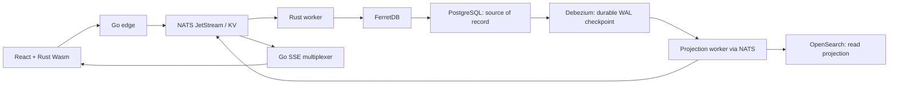

# YAJA — Yet Another Jira Alternative


YAJA is an open-source foundation for a dynamic-field, event-driven project
management system. This repository implements the ADR-001 engineering protocol,
a small Rust equality parser, a live NATS boundary probe, and typed synchronization
contracts. The full YAJA application is a roadmap, not a delivered feature.
CI badge: add the repository-specific Actions badge after publishing a remote.

## Architecture



The diagram shows the target architecture. Debezium, the indexer, Go edge, React,
Rhai, and Wasm emitters are not implemented by this baseline. See
[the roadmap and limits](docs/IMPLEMENTATION.md) and the supplied
[v0.2 design reference](docs/reference/YAJA-v0.2.md).

Architectural invariants:

- Mutate one document atomically; use asynchronous sagas for multi-document work.
- Never synchronously consult OpenSearch to authorize or validate a write.
- Compile JQL once in shared Rust; do not duplicate client evaluation logic.
- Stamp compiled artifacts and provisional mutations with an exact schema epoch.
- Treat optimistic UI state as provisional until authoritative SSE reconciliation.
- Checkpoint CDC against PostgreSQL WAL, independently of worker lifetime.
- Use typed BSON and the MongoDB driver's `doc!` macro for future database queries.
- Place pure Rust logic in `src/pure/`, physical Rust boundaries in `src/io/`.
  Go pure contracts live in `go/pure/`; future Go adapters belong in `go/io/`,
  which the same hook audits. This separate Go tree keeps Cargo's required
  `src/pure/*` and `src/io/*` workspace globs valid.

## Quickstart (Windows 11 and Ubuntu)

Install Python 3.10+, Git, Rust stable with Cargo, Go 1.22+, and Podman with a
Compose provider (`podman-compose` or Docker Compose). The runtime needs Internet
access for initial image pulls, about 4 GiB available memory, and free ports
5432, 27017, 4222, 8222, and 9200. npm/pnpm is optional for the declarations-only
JavaScript workspace. No third-party Python packages are required.

For an empty directory containing the generator:

```text
python scaffold.py
```

The generator writes complete files without overwriting differences, initializes
`main`, starts the local stack, runs verification, and commits only on success.
For an existing checkout:

```text
python scripts/setup_env.py --start
python scripts/verify.py
```

On Windows, start the Podman VM first with `podman machine start`. Linux hosts
and the Linux VM need `vm.max_map_count` at least 262144 for OpenSearch; the
Python CI preparation helper configures this in the disposable Ubuntu runner.
Read [SECURITY.md](SECURITY.md) before exposing development ports.

Equivalent direct Podman commands:

```text
podman compose -f docker-compose.yml up -d
python scripts/healthcheck.py --wait 180
python spikes/active_spike.py
cargo test --locked --workspace
go test ./go/pure/sync_contract/...
podman compose -f docker-compose.yml logs
podman compose -f docker-compose.yml down
```

`podman-compose -f docker-compose.yml up -d` is also supported. Container data
is ephemeral and is lost on container removal. PostgreSQL uses the requested
local database/user/password: `yaja` / `postgres` / `postgres`.

## Enforcement and contribution

Read [CONTRIBUTING.md](CONTRIBUTING.md) and [ADR-001](docs/ADR-001-AI-TESTING.md).
Git's hooks path is `.githooks`. On Windows, Git uses its bundled POSIX launcher;
on Ubuntu it uses `/bin/sh`. The two-line launcher only invokes Python. The `.bat`
launcher supports direct Windows invocation. No shell logic implements policy.

The hook scans every staged I/O file for banned tokens, executes a fresh physical
spike for boundary/dependency changes, requires staged Markdown with code, and
tests an isolated export of the Git index. Rust and Go tests fail if their tools
are absent. A Track A-only run (`python scripts/verify.py --pure`) is available
while working on pure logic. It does not certify I/O changes.

The FerretDB 1.24.2 compatibility line is intentional: the supplied stock
PostgreSQL 16 requirement matches the [1.x PostgreSQL backend](https://docs.ferretdb.io/v1.24/quickstart-guide/docker/).
This is not an endorsement of that legacy line for deployment. Review supported
versions, image digests, TLS, authentication, and backend migration before release.

## Publish

```text
git remote add origin <YOUR_GITHUB_REPO_URL>
git push -u origin main
```

Before accepting public reports, enable GitHub private vulnerability reporting
and define the community reporting channel described in SECURITY.md and the
Code of Conduct. Code is Apache-2.0; Contributor Covenant text retains its
upstream CC-BY-4.0 attribution.
