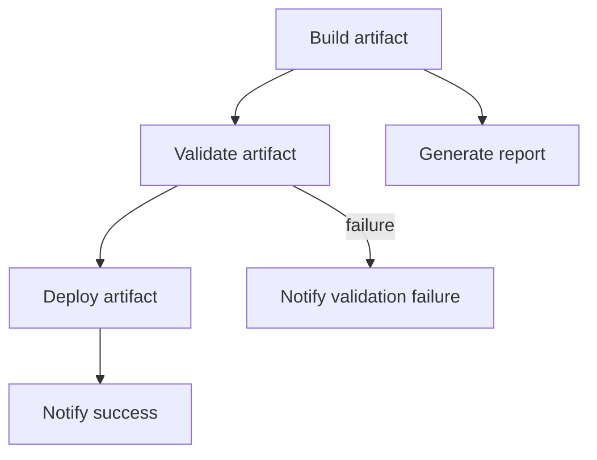
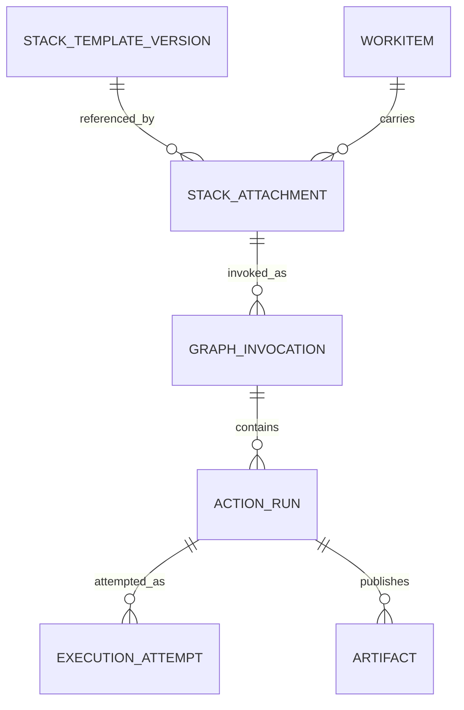
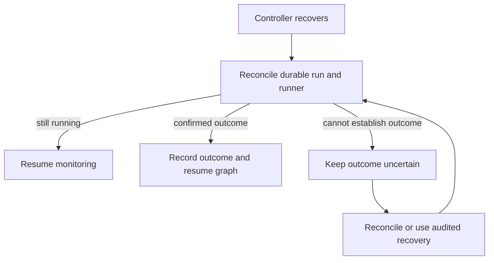
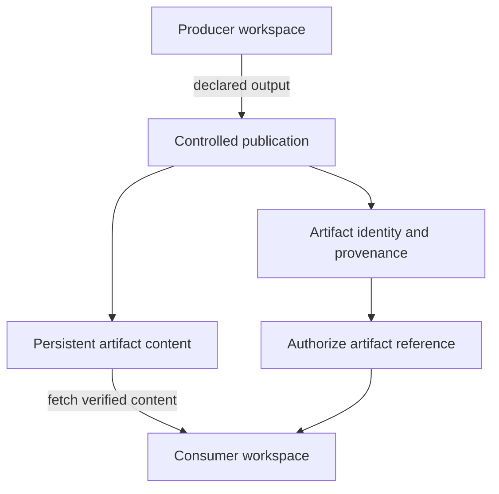
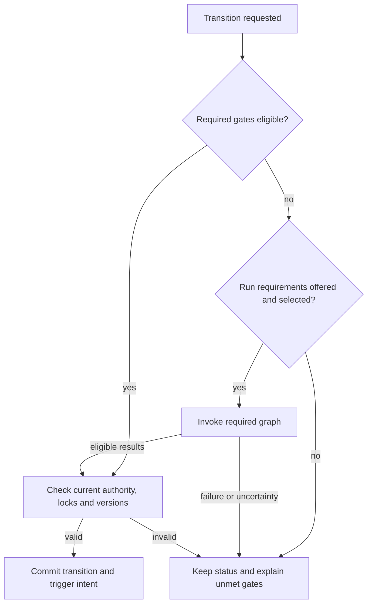

# Design proposal: WorkItem action stacks and workflow-integrated execution

## What I want to add

I want to add an execution dimension to Kehila's WorkItems. Today, the workflow model describes the item's lifecycle through its status. I also want the item to carry executable actions: call an API, invoke a script, validate an artifact, or manipulate the WorkItem or a related project object through Kehila's internal commands.

An action is a single execution unit with its own typed parameters and outputs. A WorkItem can have several actions, grouped into an **action stack**. The stack is a dependency graph: independent actions can run concurrently, while dependent actions wait for the outcomes they require.

This applies to Task, Milestone, and custom WorkItem types. I do not want the design tied to the Task type.

The way I think about it is a Jenkins-like execution engine inside a WorkItem, with the WorkItem providing the business context. I want manual execution and workflow-triggered execution, reusable project templates, and a clear history of what actually happened.

## Proposal status

I am documenting this as Kehila's contributor and maintainer. The product decisions in this issue represent the direction I have selected for future development. The technical contracts and implementation still need to be designed, tested, and delivered.

I want this issue to serve as the parent design proposal, with implementation work split into focused child issues. It does not automatically change the existing M1 milestone. I will record any scope change explicitly in the product decisions and backlog.

## A concrete example

A release WorkItem could carry the following stack:

Build publishes an artifact. Validate and Generate report can then run in parallel. Deploy requires successful validation and, if configured, human approval. The failure notification runs only when validation fails.

The workflow can require an eligible validation result before accepting Done, or require the containing graph to terminate as well. These rules are explicit. A successful action does not automatically complete the WorkItem, and a failed optional action does not automatically change its status.

The arrows illustrate execution dependencies. Data passed between actions uses separate, explicit typed bindings.

## How I want to model it

I want a clear distinction between reusable definitions, attachments, executions, and attempts. An action can run many times; its configuration and its latest outcome must not become the same record.

| Concept | Responsibility |
| --- | --- |
| Action type / handler | Application capability with its own typed parameter schema, output schema, and execution/retry capabilities. Initial categories: internal commands, HTTP calls, and container scripts. |
| Action definition version | Project-owned, versioned executable configuration: handler, parameter bindings, outputs, execution profile, and applicable execution policies. |
| Stack template version | Project-owned fixed dependency graph, action versions, bindings, conditions, and applicable policies. |
| Stack attachment | A WorkItem's reference to a pinned template version, with permitted parameter values. |
| WorkItem-specific stack/action | Independently authored behavior attached to one WorkItem, subject to separate authoring permission and project policy. |
| Graph invocation | One admitted execution intention with identity, resolved inputs, selected graph, authority, locks, progress, and outcome. |
| Action run | One logical action execution within an invocation. |
| Attempt | One execution attempt; safe retries belong to the same logical run. |
| Artifact | Immutable published output identity with durable metadata/provenance and separately retained content. |
| Workflow gate | An explicit requirement for eligible action success and optionally graph termination. |

This is the conceptual model I want the implementation to preserve. The database mapping remains design work. In particular, an invocation, an action run, an attempt, a command replay identity, and an artifact identity are separate concepts.

This diagram shows template-backed executions. WorkItem-specific stacks use the same execution model without requiring a template origin. Conditional or reused results may have no new execution attempt.

## Execution behavior

### Admission, locks, and mutations

I want an invocation to be admitted against a bounded, fixed graph with pinned definitions and declared inputs. Kehila must resolve the available inputs, identify reusable results and approval requirements, and persist the invocation together with coherent locks on the controlled input sources.

Requests outside the queue or admission budget should be rejected before acquiring locks. Inputs supplied by upstream actions are bound to the exact producing run when those outputs become available.

I want durable application locks, not PostgreSQL transactions left open while a script runs. Short transactions should enforce lock ownership, versions, configuration consistency, admission, and lifecycle updates.

All write paths—including UI, API, imports, automation, internal actions, and administrative operations—must enforce locks. A lock grants no authority to mutate its target. Action writes continue through Kehila domain commands, with current grants, version checks, history, and operation identity.

A controller crash must not silently release locks. When a deadline expires, Kehila starts cancellation and reconciliation. Forced termination and emergency release need explicit, audited behavior.

If status is a declared locked input or explicitly frozen, advancement waits for graph termination and lock release. Pending transition requests retain their initiator and source/destination intention and must not overwrite intervening status changes.

### Runs, attempts, retries, and uncertainty

I do not want a timeout or a lost response treated as proof that nothing happened. The system must distinguish a confirmed failure from an execution whose outcome is still unknown.

Internal retry uses the original Kehila command identity. HTTP retry uses the same remote idempotency identity where supported. Script retry requires an explicit safety/reconciliation contract; a container restart is not evidence of safety.

Bound attempts, backoff, and overall deadlines. Controller ownership must prevent duplicate dispatch. Kubernetes Job retries, Pod replacement, and local restart policies must not independently bypass action retry rules.

Cancellation is a request, not proof of termination. Killing a runner does not undo a remote operation. Preserve partial and uncertain outcomes; they cannot satisfy success gates. Block conflicting execution while unresolved effects make repetition unsafe.

I have chosen not to include automatic compensation. If one action succeeds and a later action fails, the successful effects remain. Recovery is an explicit operation. Ordinary cleanup and cancellation cleanup are separate configured behaviors.

The controller must recover by observing existing execution, not by immediately launching it again:

Retry is a separate decision governed by the action's safe-repetition contract. Neither controller recovery nor runner replacement is permission to repeat an external effect.

### Artifacts

I want temporary execution storage and persistent artifact storage to be separate. A script produces files inside its container, but a path such as `/output/report.pdf` will disappear when the container is removed. The action must explicitly publish the file before another action can reference it.

The downstream input holds an artifact ID, not the producer's container path or a public download URL. Access is authorized before the runner materializes the file into the consumer's own workspace.

Publication copies/uploads content into an artifact store and records immutable identity, checksum, size, ownership, producer run, and provenance. Consumers authorize access, then materialize content in their own temporary workspace.

My preferred storage direction is a managed persistent filesystem locally and object storage for Kubernetes deployment. I still need to validate the adapters. Each execution container should receive only the access it needs; a shared persistent volume mounted into every container is not a requirement.

Required publication must finish before outputs are reported available. Publication failure must not automatically rerun side-effecting scripts. Define publication recovery and orphan cleanup.

I want execution history, attempts, audit records, logs, and artifact metadata retained indefinitely. Artifact content is also retained indefinitely by default, but the administrator may configure an expiry such as 90 days or one year.

When content expires, its metadata remains visible as **Content expired**. A gate or downstream action that requires the actual bytes cannot use the expired content. Active consumers protect the artifacts they need. Content expiry does not erase execution identities, history, or replay tombstones.

Indefinite retention does not mean unlimited output capture. Capture and upload limits remain mandatory, with visible handling when a limit is reached.

### Authority, approvals, and secrets

I want execution authority to depend on how the action was invoked:

| Invocation | Execution authority |
| --- | --- |
| Manual action or “Run with prerequisites” | The invoking user's current permissions |
| Workflow event | The triggering user or an explicitly approved service identity, as configured |
| Schedule | An approved identity for unattended execution |
| Rule-based webhook | The identity selected by the authorized project rule |
| Direct invocation API | The invoking identity's permissions |

I want separate permissions for authoring, attachment configuration, invocation, profile/connection use, approval, sensitive execution data, cancellation, forced termination, gate waivers, and emergency recovery. The exact grant names and matrix still need to be specified.

Workflow service execution requires explicit authorized trigger configuration and controlled parameters. Manual invocation cannot select a more privileged service identity.

Check required current authority before each action starts. Approval is evidence of consent, not a grant. Obtain secrets using approved references; do not store literal secrets in templates, snapshots, or ordinary logs. WorkItem visibility does not imply access to all execution data.

### Workflow and trigger integration

I want workflows to support three explicit behaviors: trigger execution, require action outcomes before a transition, and request automatic advancement. Attaching a stack alone does not enable any of them.

A transition's prerequisites must run before that transition. An action triggered after entering Done cannot also be a condition for entering Done. Where the process needs a visible execution stage, the workflow can use an intermediate status.

This diagram covers ordinary transitions. A permitted gate waiver or system emergency operation follows its separate audited contract. Successful execution never bypasses the current transition checks.

Gate evaluation checks stable approved definitions, relevant input compatibility, applicable prerequisite requirements, freshness, artifact availability when needed, and configured graph-termination policy.

Reusing historical success versus intentionally repeating side effects requires explicit semantics. Trigger deduplication is distinct from result reuse.

Durably record trigger intent with the originating domain mutation. Persist blocked/rejected dispatch outcomes. Schedules and incoming events use stable deduplication identities. Protect against recursive mutation-trigger chains without treating legitimate repeat events as duplicates.

## Execution environments

I want execution orchestration independent of the runner. The action controller owns graph progress, permissions, approvals, locks, and outcomes. The selected handler owns the actual execution boundary.

| Action category | Execution boundary |
| --- | --- |
| Internal command | Kehila's authorized domain command path |
| HTTP call | A dedicated handler using an approved connection |
| Script, local deployment | A fresh Docker or Podman container per attempt |
| Script, Kubernetes deployment | A Job-managed Pod per attempt |

Kubernetes is a target runner environment in this proposal, not an already-established deployment capability. The repository currently targets local use and uses Compose for development.

An execution profile defines the approved image, runtime authority, network access, secrets, mounts, resource limits, and deadline. Parameters supply values within that profile; they do not grant additional access.

A fresh container is useful separation, but it is not sufficient isolation by itself. Local containers and Kubernetes Jobs need separate verification. Kubernetes retries or replacement Pods must follow Kehila's retry contract.

## What users should see

Inside a WorkItem, I want attached stacks with expandable dependency graphs and a chronological execution history. Template-backed graphs are read-only; permitted parameters remain editable when they are not locked by execution.

The activity view should include all recorded execution detail through filters. Its default view should show significant events, with logs and scheduler details loaded on demand. Access checks apply before display, regardless of the selected filters.

I want **latest run outcome** and **current gate eligibility** shown separately. Yesterday's successful validation is still a success in history even when today's input change makes it unusable for a gate.

Project administrators can waive a gate only when the gate permits it, with a mandatory reason. System administrators have explicit emergency recovery operations. Neither operation should fabricate a successful run.

## Scope and delivery

### First complete feature milestone

I want the complete feature to cover the following capabilities, delivered in reviewable increments:

- Project-owned versioned definitions/templates and WorkItem-specific authoring.
- Flat DAGs contained within a single WorkItem.
- Defaults by WorkItem type; parameter-only template attachments and explicit upgrades.
- Internal, HTTP, and container-script execution.
- Locks, concurrency, durable dispatch, safe retries, approvals, cancellation, recovery, gates, and activity.
- Typed outputs and persistent artifacts.
- Trigger scope includes status/field and other WorkItem events, schedules, and authenticated external events, introduced in stages.

For the MVP, I am keeping each graph inside one WorkItem and allowing action nodes only. That simplifies the execution boundary. I still want all three action categories in the first complete feature milestone; they do not need to ship together. Trigger sources can also arrive in stages, with their supported scope stated clearly.

### Possible later extensions

I may extend the model later to support:

- Cross-WorkItem graph dependencies within a project.
- Versioned nested stack composition.

I am leaving cross-project graph dependencies, an instance-wide template catalog, automatic compensation, dynamic graph generation, arbitrary parameter-expression execution, and structural template-attachment overrides outside this proposal.

### How I propose to split implementation

1. Pure domain/configuration contracts, identities, states, grant matrix, and gate compatibility.
2. Durable PostgreSQL invocation/attempt/trigger/lock mapping and contention/recovery proofs.
3. Internal action handler with scheduler, durable dispatch, and workflow integration.
4. Typed outputs, artifact publication/storage, approvals, and execution read models.
5. HTTP handler, connection authority, idempotency, and remote reconciliation.
6. Local container runner and separately verified Kubernetes runner.
7. Scheduled/external triggers, administration, unified activity UI, and release qualification.

This is my proposed order, subject to dependency analysis. I want child issues created once the affected contracts and prerequisites are clear.

## Details I still need to resolve

The product direction is selected, but I do not consider the technical contract complete. Before the relevant capability ships, I want the following details resolved with evidence:

- Exact entity/state machine, command families, API envelopes, immutable version rules, error precedence, and schema bounds.
- Whether Action type/handler capability registration itself is extensible; approved internal command and HTTP response/output mappings.
- Exact input-address/lock model, related-object scope, overlapping-reader semantics, lock ordering, and atomic admission. Define structural changes to related input objects and configuration changes during execution.
- Finalize input capture for external sources; inputs discovered by arbitrary scripts cannot silently escape declarations.
- Run-result reuse policy: which read-only versus side-effecting actions may reuse success, graph/prerequisite provenance compatibility, gate freshness, and whether a new invocation reuses prior results by default.
- Cancellation completion with cleanup, unreachable/orphan runners, external uncertainty, and emergency lock release. Confirmed local termination and resolved remote outcomes are separate facts; define exactly when normal locks release and conflict protection remains.
- Kubernetes Job ownership/fencing, replacement prevention, Pod termination verification, local container ownership/restart prevention, and artifact/log collection under force termination.
- Runner threat model and execution profile controls: pinned images, nonprivileged runtime, network/egress, filesystem, secret delivery, budgets, and stronger isolation where needed. A new container alone is not a sufficient security boundary.
- Approval quorum/revocation behavior while waiting, deadlines, retries, rejection outcomes, and service-run cancellation ownership.
- Disabled-version effect on prior gate successes, pending transitions, and template references.
- Exact schedule/DST semantics, authenticated webhook delivery/replay handling, recursion limits, quotas, and optional notification behavior.
- Artifact storage backend choice, upload/download protocol, retention origin, active-use protections, integrity checks, atomic publication, orphan cleanup, backup/restore, and publication recovery.
- Log capture bounds, visible truncation versus termination policy, sensitive-data handling, indefinite-retention capacity planning, and authorized redaction exceptions.
- Performance objectives and measured budgets; Windows/Linux and local/Kubernetes qualification matrices.
- Repository product-decision/requirement/backlog IDs and explicit D-012 scope amendment. Do not invent IDs or silently add this proposal to M1.

## What I will use to assess completion

I want reproducible evidence at the appropriate pure-rule, storage, service, runner, and UI boundaries. A passing pure test does not establish that a container, remote API, or production transaction behaves correctly.

The implementation must demonstrate:

- [ ] Attach a pinned template to Task, Milestone, and a custom WorkItem; missing parameters permit creation but block execution.
- [ ] Reject DAG cycles, invalid references, incompatible typed bindings, and forbidden template structural edits.
- [ ] Execute sequential and parallel branches; failure isolation, stop-stack policy, conditional skips, and cleanup behave as configured.
- [ ] Manual invocation and “with prerequisites” enforce the invoking user's permissions. Workflow service execution obeys its explicit scoped policy.
- [ ] Distinguish intentional rerun, safe retry, duplicate event delivery, and transport replay without duplicate admission or effects.
- [ ] Acquire coherent graph-wide locks; reject edits from every write path, including graph-owned actions; permit unrelated changes.
- [ ] Reject structural lifecycle operations during active execution; enforce optional status freeze and normal default transition behavior.
- [ ] Demonstrate relevant-input gate invalidation, unrelated-edit compatibility, prerequisite/output provenance, and expired required artifact handling.
- [ ] Enforce independent approval/quorum policies, self-approval default, approval timeout, and current execution authority.
- [ ] Atomically persist originating changes and trigger intent; recover a crash between commit and dispatch without losing intent or duplicating invocation.
- [ ] Prove multi-controller ownership, restart reconciliation, retained locks, existing-runner reconnection, and uncertain-outcome protection.
- [ ] Exercise safe HTTP retry and a remote success followed by lost response; do not classify uncertainty as ordinary failure.
- [ ] Demonstrate cancellation, timeout escalation, forced Pod/container termination, no replacement/restart, configurable cleanup, and separate remote uncertainty.
- [ ] Publish, authorize, verify, and consume artifacts across fresh containers; required publication failure cannot falsely report available output.
- [ ] Demonstrate indefinitely retained history/logs within capture limits and optional artifact-content expiry without deleting metadata/provenance.
- [ ] Preview/validate/atomically upgrade attachments; preserve compatible parameters, history, gates, and pinned active execution.
- [ ] Verify archive versus disable controls and queued-start rejection.
- [ ] Test concurrency policies and shared-target conflicts; reject excess admission before lock acquisition.
- [ ] Verify scheduled missed-occurrence policies, timezone cases, authenticated external events, direct invocation, deduplication, and trigger-loop protection.
- [ ] Gate waiver/emergency recovery is authorized and audited without fabricated success or silent invariant bypass.
- [ ] Unified activity uses filtered, paginated, authorized execution/log views; latest outcome and current gate eligibility remain distinct.
- [ ] Validate budget enforcement, oversized/corrupt input, secret access, unauthorized egress/mounts, and resource exhaustion.
- [ ] Run chaos checks for controller, database, event transport, artifact store, and runner interruption; verify backup/restore preserves identities and unresolved execution.
- [ ] Qualify local Docker/Podman and Kubernetes independently; declare supported host/runtime combinations and evidence limits.

## Related work and documentation

I want this feature coordinated with #7 (B-003 contracts), #26 (coordinated storage/replay), #29 (workflows), #30 (conversion/migration), #32 (permissions), and #15 (completion/reopening/resource effects). An action does not implicitly start billing, report usage, release reservations, or bypass resource rules.

As each slice is accepted and implemented, I will update the product requirements, decisions, open questions, backlog, domain contracts, architecture records, access and threat models, implementation status, test strategy, recovery procedures, and user documentation.

The existing 90-day command replay policy remains separate from indefinitely retained execution history. Extend operation namespaces and durable trigger/run identities deliberately; do not reuse the existing lifecycle `Action` enum as an execution model without resolving terminology and compatibility.

## My design decisions

I have kept all 50 decisions below so the scope and defaults remain traceable. These numbers belong to this proposal; they are not repository D-* identifiers.

Expand the complete decision register

| # | Selected behavior |
| --- | --- |
| 1 | Reusable project definitions coexist with WorkItem-specific actions/stacks. Administrators may define stack templates. Action types have their own parameter schemas. |
| 2 | Stacks are acyclic dependency graphs. Independent actions may execute concurrently. |
| 3 | Explicit workflow rules may trigger actions, gate transitions, and request automatic advancement. Attachments alone imply none of these behaviors. |
| 4 | Gate eligibility depends on relevant resolved inputs and the pinned execution definition. Relevant changes invalidate eligibility; history remains. External-state freshness requires explicit policy. |
| 5 | Attached template versions remain pinned. Authorized upgrades are explicit; template edits never silently propagate. |
| 6 | Manual controls offer “Run this action” and “Run with prerequisites.” Neither bypasses dependencies. Eligible successes may be reused; intentional re-execution is explicit. |
| 7 | Failure isolates dependent branches by default. Critical actions may stop the stack. Dependencies may require success, failure, or completion regardless of outcome. |
| 8 | Automatic retry requires a defined safe-repetition mechanism. Attempts retain the logical run identity; intentional new execution creates a new run. Unknown outcomes require reconciliation/intervention. |
| 9 | Manual execution always uses the invoking user's current authority, including prerequisites. Workflow execution explicitly selects triggering-user authority or an approved service identity. |
| 10 | Use a runner abstraction: fresh Docker/Podman containers locally and Kubernetes Job-managed Pods for script attempts. Dedicated internal/HTTP handlers need not create containers. Implementation order remains open. |
| 11 | Outputs are typed, with explicit downstream mappings. Files/large outputs use immutable artifact IDs backed by persistent storage. |
| 12 | Relevant controlled inputs are locked during execution; unrelated data remains editable. External systems cannot be frozen by Kehila and need captured values/versions. |
| 13 | Locks cover the entire selected invocation graph, including queued work and retries. These are durable application restrictions, not long-lived database transactions. |
| 14 | Concurrency is configurable; overlapping execution is rejected by default. Explicit policies may queue or allow safe parallelism. Same-identity retries return the existing invocation. Shared external targets may need shared concurrency restrictions. |
| 15 | Target trigger scope includes WorkItem events, schedules, and authenticated external events, delivered in stages. Duplicate delivery is deduplicated; trigger loops require protection. |
| 16 | Input locks apply to everyone, including the owning graph. Actions may update unlocked objects through authorized commands. Attempts to mutate locked inputs fail. |
| 17 | No automatic compensation. Successful effects remain after later failure. Recovery is explicitly invoked; cleanup does not imply business rollback. |
| 18 | Cancellation retains input locks until execution termination is confirmed. Administrators can terminate the specific Pod/container; a configurable cancellation timeout can escalate to forced termination. External uncertainty remains tracked. |
| 19 | Reusable configured action definitions and templates are project-owned; there is no shared instance catalog in this proposal. Application handlers remain common capabilities. |
| 20 | Template attachments permit parameter customization only, not structural overrides or forks through attachment editing. Separately authored WorkItem-specific stacks remain allowed. |
| 21 | Project policy controls approved executables versus inline scripts, defaulting to approved executables. Script content and image identity are pinned; changes create new versions. |
| 22 | Gates reference stable action identities or explicitly approved alternatives. Names or self-declared capabilities alone cannot satisfy gates. |
| 23 | Unmet gates reject transitions by default. A transition can explicitly offer “Run requirements and advance.” Status remains unchanged until acceptance; user-requested prerequisite execution uses manual authority. |
| 24 | Active execution blocks WorkItem archival, type conversion, and workflow migration. Project archival is blocked while it contains active execution. Cancellation is separate. |
| 25 | Optional human approval is an action execution requirement. It covers exact definitions/inputs, has a deadline, and does not grant execution authority. Waiting holds graph locks. |
| 26 | Execution history, attempts, audit records, logs, artifact metadata, and provenance are retained indefinitely. Artifact content is indefinite by default, with optional time-based expiry (e.g. 90 days or one year). Active consumers protect content from expiry. |
| 27 | Project-admin gate waivers are configurable per gate and prohibited by default. Waivers require a reason and apply to one transition; they do not rewrite action outcomes or bypass active locks/system phase rules. |
| 28 | System administrators have explicitly defined emergency recovery operations with mandatory audit. Normal operations preserve invariants; exceptions do not falsify execution outcomes. |
| 29 | WorkItem types provide pinned default attachments on creation. Authorized users may add stacks. Default changes affect newly created items; required attachments cannot be removed through ordinary attachment management. |
| 30 | Missing required action parameters do not block WorkItem creation. Attachments show “Configuration required”; execution waits for required inputs. |
| 31 | WorkItems show stacks with expandable dependency graphs and separate run history. Template attachment graphs are read-only. Latest outcome and current gate eligibility are distinct. |
| 32 | The first complete feature milestone includes internal commands, HTTP calls, and container scripts, implemented in separate verified slices. Local and Kubernetes evidence are separate. |
| 33 | Restart/crash recovery reconciles existing execution and resumes orchestration. Locks and progress are durable; unknown outcomes stay uncertain; replacement execution is not automatic. |
| 34 | Transitions configure whether designated action results suffice or containing-graph termination is also required. Default: wait for graph termination. Required gates still must pass. |
| 35 | Limits are layered: system ceilings → project budgets → execution profiles. Queue admission is bounded; log-limit handling is explicit and visible. |
| 36 | MVP execution graphs stay within one WorkItem. Cross-WorkItem dependencies within a project are a possible future extension, not committed scope. Related-object input reads and authorized unlocked mutations remain possible. |
| 37 | Unified filterable activity exposes all recorded execution detail, defaulting to significant events. Detailed logs/events load on demand from separate records with independent access checks; do not duplicate log storage. |
| 38 | Upgrades preview changes, preserve compatible values/mappings, and resolve incompatibilities before atomic application. Active execution blocks upgrades. Existing gates must remain valid. |
| 39 | Archive and disable are separate: archive blocks new attachments; disabling a version blocks new execution, including queued starts. History remains. Running cancellation is explicit. |
| 40 | MVP stacks contain action nodes only. Versioned nested stacks are a possible future extension. |
| 41 | Cancellation cleanup is configurable per stack, defaulting to cancel all pending actions. Permitted cleanup has explicit authority and deadlines; forced termination must specify cleanup handling. |
| 42 | Inputs support literals, explicit bindings, and constrained deterministic expressions. Expressions declare all dependencies and cannot access network/filesystem/secrets/undeclared state. Template authors own expressions. |
| 43 | Fixed graphs support declared conditions. False conditions record Skipped, not Succeeded. Skips do not satisfy success gates; dependency skip handling must be explicit. |
| 44 | WorkItem changes and their configured trigger intents commit atomically. Asynchronous dispatch is durable and deduplicated; execution rejection/blockage is visible. |
| 45 | Schedules configure skip, run-once, or bounded catch-up for missed occurrences; default skip. Specify timezone/DST semantics, stable occurrence IDs, maximum catch-up count/age, and unattended service authority. |
| 46 | Support authenticated event-ingestion webhooks and a separate authorized direct-invocation API. Webhook rules fix allowed targets/actions/inputs/authority; direct invocation uses invoking-identity authority. |
| 47 | Approval requirements configure self-approval, prohibited by default, and a number of distinct eligible approvers. Group membership identifies eligible people, not a group approval identity. |
| 48 | Resolve inputs at graph admission, except bindings to upstream outputs resolved when produced. Controlled-source snapshots/locks are acquired coherently. Credentials are obtained through authorized references at execution, not copied into snapshots. |
| 49 | Stacks may freeze WorkItem status explicitly; default allows eligible status changes. Gates, declared-input locks, concurrency, and ordinary transition checks still apply. |
| 50 | Separate cancellation grants cover own runs and any project run. Cancel-own is granted by default to permitted invokers. Service-identity workflow runs need project-level cancellation authority; force termination is separate administration. |

## Repository baseline and existing contracts

This proposal is based on `main` at `12871228bae3a1b6a45b08f188741a18631ac5d7`, including:

- [B-003 contract](https://github.com/MrQuality/kehila/blob/12871228bae3a1b6a45b08f188741a18631ac5d7/docs/product/B-003-contract.md)
- [Product decisions](https://github.com/MrQuality/kehila/blob/12871228bae3a1b6a45b08f188741a18631ac5d7/docs/product/decisions.md)
- [Implementation status](https://github.com/MrQuality/kehila/blob/12871228bae3a1b6a45b08f188741a18631ac5d7/docs/IMPLEMENTATION.md)
- [WorkItem rules](https://github.com/MrQuality/kehila/blob/12871228bae3a1b6a45b08f188741a18631ac5d7/src/pure/task_contract/src/work_item.rs)
- [Operation identity and replay](https://github.com/MrQuality/kehila/blob/12871228bae3a1b6a45b08f188741a18631ac5d7/src/pure/task_contract/src/operation.rs)

D-012 currently excludes a general status-action automation engine. I will record an explicit scoped amendment or successor decision before changing that scope. The configurable workflow model currently has pure typed rules; runtime integration remains pending.
