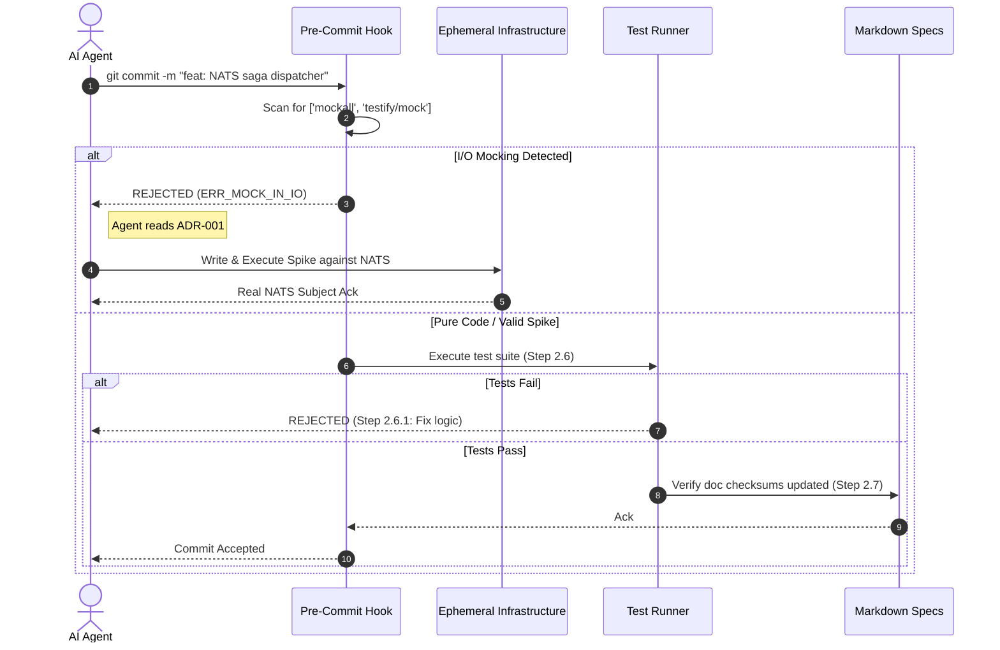

# ADR-001: YAJA AI Engineering Protocol — Technical Specification

## 1. System Overview & Invariants

* **Objective**: A deterministic, machine-enforceable development and testing protocol for AI coding agents operating on the YAJA v0.2 codebase. This protocol guarantees that asynchronous CQRS boundaries and CDC pipelines are verified against physical infrastructure, preventing AI hallucination of successful mocked I/O, and enforces a strict 7-step verification-driven development loop.
* **Target Stack**:
* **Enforcement**: Bash (Git Pre-Commit Hooks), `ripgrep` (AST/Regex auditing).
* **Infrastructure**: `docker-compose` (Ephemeral FerretDB, PostgreSQL, NATS, OpenSearch).
* **Test Runners**: `cargo test` (Rust), `go test` (Go), `vitest` (React/Wasm).


* **Critical Invariants**:
* **Zero-Assumption Rule (The Spike Mandate)**: Development MUST NOT proceed based on unverified assumptions about network, infrastructure, or library behavior. If information cannot be gathered definitively, an executable Spike MUST be written and executed against a live local container before design begins.
* **Dual-Track TDD Integration**:
* *Track A (Pure Logic)*: Pure functions (e.g., Wasm JQL compilation) MUST be unit-tested in isolation.
* *Track C (I/O Boundaries)*: Components interacting with Postgres, NATS, or OpenSearch MUST be tested via executable verification scripts against persistent local Docker instances.


* **I/O Mocking Ban**: AI agents are strictly forbidden from mocking database layers, event buses, or CDC pipelines. The use of `mockall`, `jest.mock`, or similar stubbing tools in I/O-bound modules is a fatal violation.


* **Anti-Requirements (MUST NOT)**:
* Do NOT bypass the git pre-commit verification hook or ignore its output directives.
* Do NOT use mocking libraries for integration tests or I/O boundary tests.
* Do NOT mark a task as "done" if a test fails; failure is expected in Phase 2.4, and iterative execution MUST continue until the physical test passes.
* Do NOT commit code without updating the relevant Markdown documentation to reflect architectural reality.


---

## 2. Data Contracts & Canonical Types

```bash
# Pre-Commit Hook Configuration (.githooks/ai_enforcer.json)
# Defines the exact AST/Regex rules the AI must pass to commit code.

```

```json
{
  "rules": [
    {
      "id": "ERR_MOCK_IN_IO",
      "forbidden_imports": ["mockall", "jest.mock", "httptest", "sqlmock"],
      "trigger_contexts": ["mongodb", "nats", "opensearch", "ferretdb"],
      "message": "FATAL: AI Mocking detected in I/O boundary. Read docs/ADR-001-AI-TESTING.md. Write an executable Spike against docker-compose."
    },
    {
      "id": "ERR_NO_SPIKE_FOUND",
      "required_files": ["spikes/active_spike.sh", "spikes/active_spike.rs"],
      "trigger_condition": "When committing to /src/io without prior spike execution",
      "message": "FATAL: Unverified assumption. Execute a spike before committing I/O logic."
    }
  ]
}

```

```typescript
// AI Agent Context State (In-Memory Tracking for Coding Agents)
export interface DevelopmentCycle {
  readonly phase: 
    | "PLAN"             // 2.1 Declare goals & requirements
    | "DESIGN"           // 2.2 Elegance, scalability, testability, security
    | "TEST_DEV"         // 2.3 Write tests
    | "TEST_EXEC_FAIL"   // 2.4 Execute tests (Failure Expected)
    | "EXECUTION"        // 2.5 Implement feature code
    | "TEST_EXEC_PASS"   // 2.6 Execute tests (Must Pass)
    | "DOCS";            // 2.7 Update documentation
  readonly activeSpikeRequired: boolean;
  readonly activeSpikePassed: boolean;
  readonly testMatrixStatus: Record<string, "PENDING" | "FAILED" | "PASSED">;
}

```

---

## 3. State Machine & Execution Flow

### State Transition Matrix

| Current State | Triggering Event | Next State | Guard Condition | Side Effects / Sidecars |
| --- | --- | --- | --- | --- |
| `PLAN` (2.1) | `REQUIREMENTS_DECLARED` | `DESIGN` | Target metrics (Performance, Security) defined | Spin up local `docker-compose` env |
| `DESIGN` (2.2) | `IO_DEPENDENCY_DETECTED` | `SPIKE_DEV` | Logic touches NATS/Postgres/OS | Pause design, require active spike script |
| `DESIGN` (2.2) | `PURE_LOGIC_ONLY` | `TEST_DEV` | Code is isomorphic/pure (e.g., JQL) | Scaffold unit tests |
| `SPIKE_DEV` | `SPIKE_EXEC_SUCCESS` | `TEST_DEV` | Container returns 2xx / valid state | Record verifiable behavior, resume design |
| `TEST_DEV` (2.3) | `TESTS_WRITTEN` | `TEST_EXEC_FAIL` | Tests cover elegance, scalability, security | Runner invoked |
| `TEST_EXEC_FAIL` (2.4) | `TEST_FAILS` | `EXECUTION` | Red phase of TDD | AI begins actual feature implementation |
| `EXECUTION` (2.5) | `CODE_COMPLETE` | `TEST_EXEC_PASS` | Git Hook passes (No banned mocks) | Re-run test suite |
| `TEST_EXEC_PASS` (2.6) | `TEST_FAILS` | `EXECUTION` | Test output parsed | Apply Step 2.6.1: Fix execution or tests |
| `TEST_EXEC_PASS` (2.6) | `TEST_PASSES` | `DOCS` | 100% pass rate achieved | Proceed to documentation |
| `DOCS` (2.7) | `DOCS_UPDATED` | `DONE` | MD specs match code | Commit allowed |

### Sequence Flow



---

## 4. API Surfaces & Error Matrix

### System Interface: `.git/hooks/pre-commit` (AI Audit Layer)

* **Standard Out**: Machine-readable violation codes intended to instruct the AI's next prompt action. The hook outputs terminal commands for the AI to execute.
* **Failure Matrix (AI Action Routing)**:

| Exit Code | Error Enum | Condition / Trigger | Client Action |
| --- | --- | --- | --- |
| `1` | `ERR_MOCK_IN_IO` | AI used a mocking library in a file importing DB/Event drivers. | Delete the mock. Run `cat docs/ADR-001.md`. Create a spike script in `spikes/` hitting the local Docker environment. |
| `2` | `ERR_UNVERIFIED_ASSUMPTION` | New dependency introduced without a corresponding spike or architectural doc update. | Stop coding. Formulate a hypothesis, write a spike to test the dependency, execute it. |
| `3` | `ERR_TEST_EXECUTION_FAILED` | TDD loop violation: Attempting to commit before Step 2.6 is fully green. | Read test logs. Apply fix to application code (or correct the test assertions). Re-run. |
| `4` | `ERR_DOCS_STALE` | Code changed in `src/` but no corresponding change in `docs/` or `*.md`. | Execute Step 2.7. Update documentation to reflect the new implementation realities. |

---

## 5. Executable Acceptance Criteria (TDD-Ready)

```gherkin
Feature: Pre-Commit Contract Enforcement

  Scenario: AI attempts to mock the CDC Pipeline (Debezium/NATS)
    Given the AI agent is in the "EXECUTION" phase for the "Saga Orchestration" module
    And the module imports the official "async-nats" Rust crate
    When the AI agent writes a test using "mockall" to simulate a NATS message
    And attempts to commit the code to the repository
    Then the pre-commit hook must intercept the action
    And exit with code 1 (ERR_MOCK_IN_IO)
    And output "FATAL: AI Mocking detected. cat docs/ADR-001.md"
    And the commit must be aborted

```

```gherkin
Feature: Verification-Driven Development (Spike Mandate)

  Scenario: Information cannot be gathered from standard web knowledge
    Given the AI agent needs to implement OpenSearch CQRS projection
    And the exact mapping of FerretDB BSON to OpenSearch JSON is unknown
    When the AI agent reaches Step 2.1 (Plan)
    Then the AI MUST NOT hallucinate the mapping format
    And MUST generate a standalone script in "spikes/os_mapping_test.sh"
    And MUST execute the script against the local Docker cluster to observe the real output
    Before proceeding to Step 2.2 (Design)

```

---

## 6. Implementation Task DAG (Chronological Milestones)

* [ ] **M1: Core Repository & ADR Documentation**
* [ ] Initialize git repository and create the `.githooks` directory.
* [ ] Configure git to use the custom hooks path (`git config core.hooksPath .githooks`).
* [ ] Save this specification document as `docs/ADR-001-AI-TESTING.md`.


* [ ] **M2: Infrastructure Scaffolding (The Spike Target)**
* [ ] Create `docker-compose.yml` containing FerretDB, PostgreSQL, OpenSearch, and NATS JetStream.
* [ ] Create a `spikes/` directory with a `README.md` defining the Spike format (Executable isolated scripts that self-destruct or output raw stdout).
* [ ] Write a health-check script that the AI can run to verify all containers are accepting connections.


* [ ] **M3: The AI Pre-Commit Hook**
* [ ] Write the `pre-commit` Bash script implementing the `ripgrep` regex bans for mocking libraries.
* [ ] Map the exit codes to explicit CLI instructions telling the AI to read `ADR-001`.


* [ ] **M4: Project Directory Scaffold (Track A vs Track C)**
* [ ] Create `src/pure/` (Wasm, JQL parsers) where the git hook allows unit tests and mocks.
* [ ] Create `src/io/` (Go SSE, Rust NATS consumers) where the git hook strictly enforces Spike-driven integration tests.