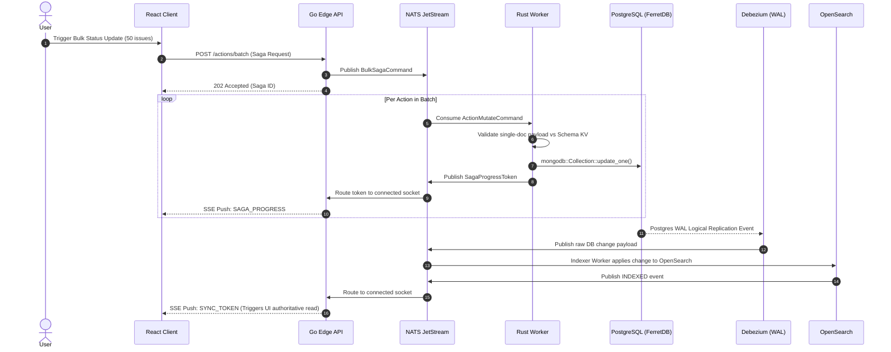

Version: 0.2
# YAJA — Project and task management — Technical Specification

Query terminology in this design refers to YAJA's own grammar, not a claim of
third-party query-language compatibility. The current parser supports only a
single equality filter; see the [naming policy](../BRANDING.md).

## 1. System Overview & Invariants

* **Objective**: A high-performance, open-source project management platform built for millions of tasks with totally dynamic custom fields. YAJA provides a real-time, optimistic frontend UX backed by an asynchronous, CQRS-driven, polyglot event-driven architecture.
* **Target Stack**:
* **Frontend**: React, React Query (for cache state), WebAssembly (Wasm) for embedded Rhai execution and local query compilation.
* **API Edge**: Go (Auth, HTTP Routing, SSE Stream Management, NATS Ingress).
* **Worker Core**: Rust (Authoritative business logic, Native Rhai execution, Saga Orchestration, Database mutation).
* **Primary DB (Writes/SoR)**: PostgreSQL accessed via FerretDB proxy (utilizing the official `mongodb` Rust driver).
* **Search DB (Reads/Projection)**: OpenSearch (Apache-2.0, CQRS read model).
* **Event Bus & State**: NATS JetStream (Sagas & CDC Pipeline) + NATS KV (Versioned Schema State).
* **CDC Engine**: Debezium tailing PostgreSQL WAL (Logical Replication).


* **Critical Invariants**:
* **Single-Document Atomicity & Sagas**: All database mutations MUST be single-document atomic. Bulk/multi-document workflows MUST execute as asynchronous Event-Driven Sagas via NATS, publishing progress tokens over SSE. Database-level multi-document transactions are strictly forbidden.
* **CQRS Availability Isolation**: The write-path (React -> Go -> NATS -> Rust -> Postgres) MUST NEVER synchronously query the read-path infrastructure (OpenSearch) to authorize or evaluate a mutation.
* **Isomorphic Compilation**: Raw query text MUST NOT be evaluated via regex or raw JavaScript. It must be compiled by a single Isomorphic Rust crate into either OpenSearch Query DSL (server-side) or a capability-tagged Rhai script (client-side Wasm).
* **Schema Epoch Strictness**: Schema definitions are versioned event streams in NATS KV. Every compiled query artifact and optimistic UI mutation MUST be stamped with a Schema Epoch. Local Wasm evaluation is strictly *provisional* and defers to authoritative SSE sync tokens.
* **Durable CDC Boundary**: The CDC connector (Debezium) MUST checkpoint against the database's native durable transaction log (Postgres WAL), entirely decoupled from the Rust worker's heap/process lifecycle.


* **Anti-Requirements (MUST NOT)**:
* Do NOT construct MongoDB queries, filters, or updates via string formatting/concatenation (e.g., `format!()`, string interpolation). All queries MUST use the official `mongodb` Rust driver's native `doc!` macro and typed struct serialization via `serde_bson`.
* Do NOT implement HTTP polling mechanisms for state reconciliation; rely exclusively on Go-multiplexed SSE.
* Do NOT evaluate view-membership via client-side AST logic duplication; use the shared Wasm-Rhai compiler.


---

## 2. Data Contracts & Canonical Types

```rust
// core_engine/src/models.rs (Rust Core)

use serde::{Deserialize, Serialize};
use bson::oid::ObjectId;

/// The canonical entity payload for Tasks/Epics
#[derive(Debug, Serialize, Deserialize)]
pub struct Action {
    #[serde(rename = "_id")]
    pub id: ObjectId,
    pub project_id: String,
    pub status: String,
    pub created_at: u64,     // Unix epoch ms
    pub _version: u64,       // For Optimistic Concurrency Control
    pub custom_fields: Vec<CustomField>,
}

/// Strictly constrained custom field structure for predictable BSON/JSONB indexing
#[derive(Debug, Serialize, Deserialize)]
#[serde(tag = "type", content = "value")]
pub enum CustomField {
    String { key: String, val: String },
    Number { key: String, val: f64 },
    Boolean { key: String, val: bool },
    Keyword { key: String, val: String },
}

/// Schema definitions stored in NATS KV
#[derive(Debug, Serialize, Deserialize)]
pub struct SchemaEpoch {
    pub project_id: String,
    pub revision: u64,       // Maps directly to NATS KV sequence revision
    pub fields: Vec<FieldDefinition>,
}

/// Emitted by the Isomorphic Query Compiler
#[derive(Debug, Serialize, Deserialize)]
pub struct CompiledQueryArtifact {
    pub epoch: u64,
    pub is_pure: bool,       // If false, client MUST degrade to Tier 2 (Wait for SSE)
    pub rhai_script: String, // e.g., "doc.status == 'Open' && evaluate_num(doc, 'points') > 5"
}

```

```typescript
// frontend/src/types/sync.ts (React Client)

export interface SSEEvent {
    type: "SYNC_TOKEN" | "SCHEMA_ADVANCED" | "SAGA_PROGRESS";
    payload: unknown;
}

export interface SyncTokenPayload {
    actionId: string;
    esOffset: number; 
}

export interface SchemaAdvancedPayload {
    projectId: string;
    newEpoch: number;
    diff: SchemaDiff[];
}

export interface MutationResponse {
    canonicalAction: Action;
    syncToken: string; // Opaque token for ES reconciliation via SSE
}

```

---

## 3. State Machine & Execution Flow

### State Transition Matrix (Optimistic UI & Schema Reconciliation)

| Current State | Triggering Event | Next State | Guard Condition | Side Effects / Sidecars |
| --- | --- | --- | --- | --- |
| `IDLE` | `CREATE_ACTION_UI` | `WASM_EVALUATING` | `compiled_script.epoch == client.current_epoch` | Pause UI input, invoke Wasm-Rhai runtime |
| `WASM_EVALUATING` | `RHAI_MATCH == TRUE` | `OPTIMISTIC_INJECT` | `compiled_script.is_pure == true` | Prepend to React Query overlay cache, Fire API `POST` |
| `WASM_EVALUATING` | `RHAI_MATCH == FALSE` | `OPTIMISTIC_SUPPRESS` | `compiled_script.is_pure == true` | Suppress injection, Fire API `POST`, Show generic Toast |
| `WASM_EVALUATING` | `SCRIPT_IMPURE` | `TIER_2_WAIT` | `compiled_script.is_pure == false` | Suppress injection, Fire API `POST`, Show generic Toast |
| `OPTIMISTIC_INJECT` | `SSE_SYNC_RECEIVED` | `AUTHORITATIVE_SYNC` | `sse.actionId == action.id` | Drop local overlay entry, Invalidate React Query ES lists |
| `OPTIMISTIC_INJECT` | `API_POST_FAILED` | `ROLLBACK_UI` | Network/5xx/Timeout | Drop overlay entry, display error notification |
| `ANY_STATE` | `SSE_SCHEMA_ADVANCED` | `FLUSH_STALE_SCHEMA` | `sse.newEpoch > client.current_epoch` | Flush Wasm LRU script cache, update local schema epoch |

### Sequence Flow: Batch Operations via NATS Saga & CDC Pipeline



---

## 4. API Surfaces & Error Matrix

### Route: `POST /api/v1/projects/{project_id}/actions`

* **Headers**: `Authorization: Bearer <jwt>`, `X-Schema-Epoch: <number>`, `Idempotency-Key: <uuid>`
* **Success Schema**:

```json
{
  "data": {
    "canonical_action": { "_id": "64d...", "status": "Open", "custom_fields": [...] },
    "sync_token": "os_offset_892374"
  }
}

```

### Route: `POST /api/v1/projects/{project_id}/actions/batch`

* **Description**: Initiates a multi-document Saga workflow. Database-level transactions are not used.
* **Headers**: `Authorization: Bearer <jwt>`, `X-Schema-Epoch: <number>`, `Idempotency-Key: <uuid>`
* **Success Schema**: `202 Accepted` returning `{ "saga_id": "saga_123" }`. Updates streamed via SSE.

### HTTP Error Matrix

| Status Code | Error Enum | Condition / Trigger | Client Action |
| --- | --- | --- | --- |
| `400` | `VALIDATION_FAILED` | Payload violates current authoritative server schema | Abort, show validation error, drop optimistic UI |
| `401` | `UNAUTHORIZED` | Missing or invalid JWT | Redirect to login |
| `403` | `FORBIDDEN` | Valid JWT, but lacking project RBAC permissions | Abort, show access error |
| `409` | `STALE_SCHEMA_EPOCH` | `X-Schema-Epoch` is behind Server KV Epoch | Flush Wasm cache, refetch schema from KV, prompt retry |
| `413` | `PAYLOAD_TOO_LARGE` | Mutation exceeds custom-field entity size limits | Abort, prompt user to reduce payload |
| `429` | `RATE_LIMIT_EXCEEDED` | Request count exceeds tenant tier thresholds | Backoff based on `Retry-After` header |
| `503` | `CDC_PIPELINE_STALLED` | DB write succeeds, OpenSearch indexer is stalled | Return 200 with `sync_token: null`. UI degrades to Tier 2 Wait |

---

## 5. Acceptance Criteria

```gherkin
Feature: CDC Pipeline Crash Isolation (OSI-Compliant Document Store)

  Scenario: Rust worker crashes after primary-DB write but before any downstream signal
    Given the Rust worker successfully persists an Action to PostgreSQL via FerretDB
    And that write is durably recorded in the PostgreSQL WAL replication slot
    When the Rust worker process crashes immediately after the DB acknowledges the write
    Then the independent Debezium CDC connector must still emit the change to NATS JetStream
    And the OpenSearch indexer must eventually index the Action without requiring worker recovery
    And restarting the Debezium connector after its own crash must resume from its last durable WAL checkpoint

```

```gherkin
Feature: Isomorphic Capability-Tagged Tier Degradation

  Scenario: Ad-hoc query relies on index-only features (Lucene Full-Text)
    Given the user types an ad-hoc query "description ~ 'server crash'"
    When the Wasm compiler processes the string locally
    Then the resulting CompiledQueryArtifact must set "is_pure" to false
    And the React client must NOT evaluate the Rhai script against optimistic payloads
    And the React client must suppress optimistic board injection
    And the system must rely on SSE Sync Tokens for data rendering

```

```gherkin
Feature: Query Safety Invariant Enforcement

  Scenario: Rust code attempts string concatenation for database queries
    Given a Rust developer implements a filter using `format!("{{\"{}\": {}}}", key, val)`
    When the CI pipeline executes standard static analysis/linting
    Then the build MUST fail citing the `String Interpolation DB Query` anti-requirement
    And require refactoring to use the `doc! { key: val }` BSON macro

```

```gherkin
Feature: Single-Document Atomicity & Saga Distribution

  Scenario: A batch update payload is received
    Given a client sends a payload to update 50 Actions
    When the Go API processes the request
    Then the Go API must enqueue 50 distinct NATS Command Events
    And return a 202 Accepted with a Saga ID
    And the Rust workers must execute exactly 50 single-document update operations without starting a multi-document database transaction

```

---

## 6. Planned Milestones

* [ ] **M1: OSI-Compliant Storage & Event Infrastructure**
* [ ] Provision PostgreSQL and FerretDB proxy containers.
* [ ] Provision OpenSearch and NATS JetStream/KV clusters.
* [ ] Deploy Debezium configured for PostgreSQL logical decoding (`pgoutput`), streaming to NATS.
* [ ] Define the Rust `Action` and `CustomField` structs with `serde` and `bson` derives.


* [ ] **M2: The Isomorphic Query Compiler (Rust & Wasm)**
* [ ] Extend the `yaja_query` Rust crate using `pest` or `nom`.
* [ ] Implement the OpenSearch Query DSL emitter (Server-target).
* [ ] Implement the Rhai script emitter with capability-tagging (`is_pure`) (Wasm/Server-target).
* [ ] Expose the crate via `wasm-bindgen` and implement browser-based compilation unit tests.


* [ ] **M3: Rust Core Workers & Saga Orchestration**
* [ ] Implement single-document `insert_one`/`update_one` mutations using the official `mongodb` Rust driver (strictly utilizing `doc!` macros).
* [ ] Implement NATS consumer logic for processing Saga commands (bulk updates).
* [ ] Implement the OpenSearch indexing consumer driven by Debezium CDC payloads.


* [ ] **M4: Polyglot API Gateway & SSE Sync Pipeline**
* [ ] Build Go API Gateway HTTP routes (`POST /actions`, `POST /actions/batch`, `GET /search`).
* [ ] Implement the Go SSE multiplexer bridging NATS `SYNC_TOKEN`, `SAGA_PROGRESS`, and `SCHEMA_ADVANCED` events.
* [ ] Implement the `409 STALE_SCHEMA_EPOCH` and `429 RATE_LIMIT_EXCEEDED` middlewares in Go.


* [ ] **M5: React Frontend, Wasm Integration & Optimistic UI**
* [ ] Integrate the compiled `yaja-query` Wasm module into the React build pipeline.
* [ ] Implement React Query cache isolation: create an ephemeral `OverlayCache` distinct from the `QueryCache`.
* [ ] Implement the Tier 0 (Inject) / Tier 1 (Suppress) injection logic driven by the Wasm `is_pure` flag and Rhai evaluation.
* [ ] Wire the SSE event listener to flush the `OverlayCache`, trigger OpenSearch refetches, and update Saga progress bars.
